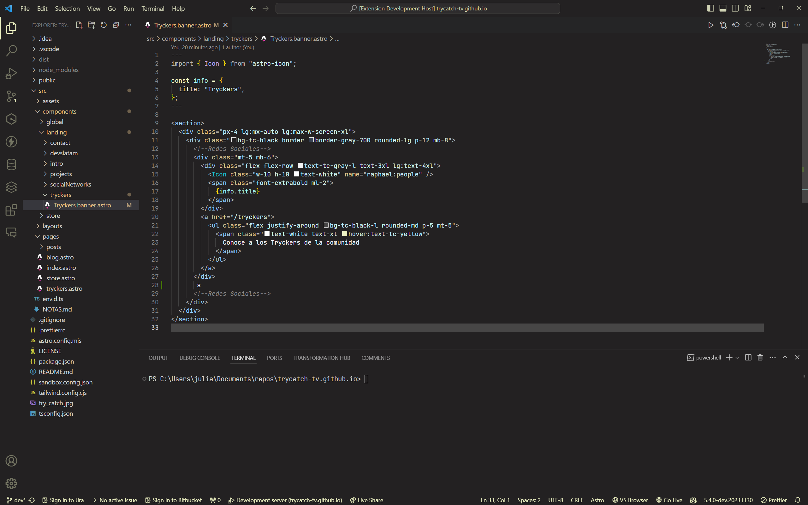

# TryCatch Theme para VSCode

## Vista previa



## Caracteristicas

Gracias a quienes estuvieron en la transmisión, disfruten de su pack de instalación que incluye:

- Trabajo
- Novia
- Nivel senior
- Programar a 10X
- 0 Bugs

### Usar con la fuente JetBrains Mono

1. **Instalar la Fuente:**
   Primero, asegúrate de tener instalada la fuente JetBrains Mono en tu sistema. Puedes descargarla desde [el sitio web de JetBrains](https://www.jetbrains.com/lp/mono/).

2. **Configurar VSCode:**
   Una vez instalada la fuente, abre el archivo de configuración de VSCode (`settings.json`). Puedes hacer esto presionando `Ctrl` + `,` y luego haciendo clic en el icono de llaves `{}` en la esquina superior derecha.

3. **Añadir la Configuración de la Fuente:**
   En `settings.json`, agrega o modifica las siguientes líneas:

   ```json
   {
     "editor.fontFamily": "'JetBrains Mono', Consolas, 'Courier New', monospace",
     "editor.fontLigatures": true
   }
   ```

   Esto configurará JetBrains Mono como la fuente del editor y habilitará las ligaduras de fuente si JetBrains Mono las soporta.

## Con el respaldo de

- [Simongiraldoc](https://www.twitch.tv/Simongiraldoc)
- [dextron_py](https://www.twitch.tv/dextron_py)
- [georgecr88](https://www.twitch.tv/georgecr88)
- [NemequenePonguta](https://www.twitch.tv/NemequenePonguta)

## Contacto

- [judlup@trycatch.tv](mailto:judlup@trycatch.tv)
- [Twitch](https://twitch.tv/trycatch)
